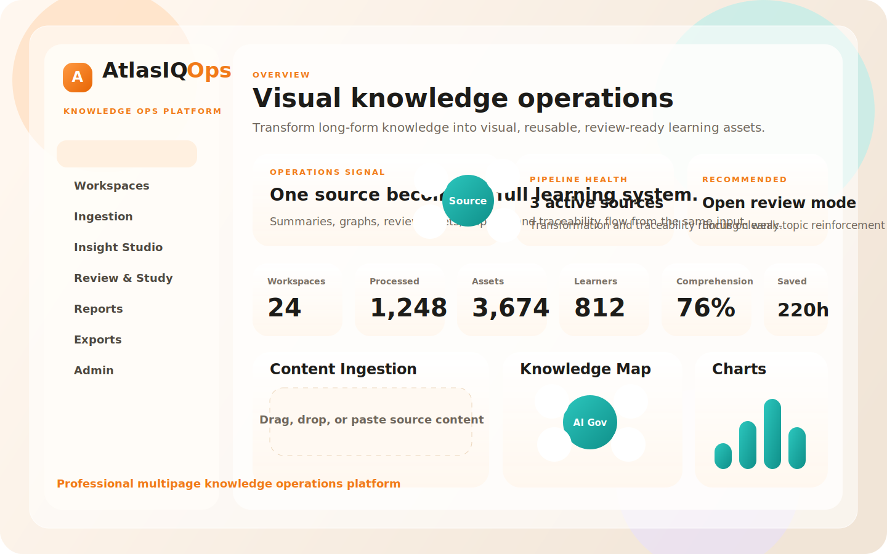
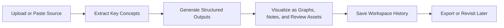
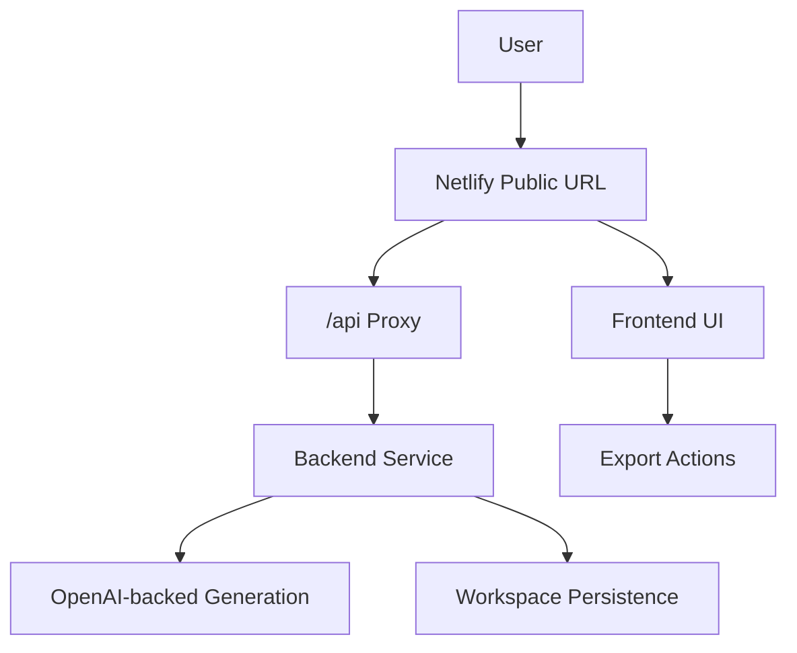

# AtlasIQ Ops

> AI-powered visual knowledge transformation platform

[](https://atlasiq-ops-platform.netlify.app/)
[](https://atlasiq-ops-platform.netlify.app/)
[](https://atlasiq-ops-platform.netlify.app/)



AtlasIQ Ops transforms unstructured learning material into structured, visual, decision-ready knowledge assets. Users can upload or paste source content, generate summaries and study outputs, explore concept maps and charts, revisit saved workspaces, and export reusable learning artifacts.

## Live

- Product and API entry: [atlasiq-ops-platform.netlify.app](https://atlasiq-ops-platform.netlify.app/)

## Why It Exists

Organizations, onboarding teams, educators, and learners all face the same problem: too much raw content and too little structure. AtlasIQ Ops converts long-form knowledge into visual learning outputs that are easier to understand, review, share, and revisit.

## Product Snapshot

| Area | What it does |
| --- | --- |
| Ingestion | Accepts text, notes, and source links to start a knowledge workflow |
| Insight Studio | Generates structured summaries, highlights, and chapter-style outputs |
| Knowledge Map | Shows a visual concept network around the uploaded source |
| Review Mode | Surfaces weak topics, recommendations, quizzes, and flashcards |
| Reports | Frames outcomes through comprehension, assets created, and time saved |
| Exports | Delivers PDF, Markdown, and JSON outputs |
| Admin | Exposes operational health, role visibility, and security messaging |

## Core Workflow



## What Makes It Strong

- Multi-page product shell with dashboard, workspaces, review, reports, exports, and admin surfaces
- Structured summary generation instead of only plain-text output
- Knowledge graph presentation for concept relationships
- Cheat notes, flashcards, quiz prompts, and review recommendations
- Per-user session handling and workspace persistence
- Source traceability framing for generated insights
- Export support for PDF, Markdown, and JSON
- Light premium UI with responsive layouts, motion, and visual panels
- Single public Netlify URL with API requests proxied behind `/api/*`

## UI Structure

### Dashboard

- KPI strip for workspaces, processed documents, assets created, comprehension, and time saved
- Ingestion panel with secure upload states
- Insight Studio with depth modes
- Knowledge map, charts, cheat notes, flashcards, and review preview

### Workspaces

- Saved workspace library
- Snapshot summaries and export actions
- Version-oriented reusable knowledge assets

### Review Mode

- Weak-topic visibility
- Recommended next actions
- Quiz-style reinforcement

### Reports

- Topic performance visuals
- Learning recommendations
- Source-linked citations

### Exports

- PDF, Markdown, and JSON handoff
- Export readiness checklist

### Admin

- Service health
- Security posture
- Role-based access overview

## Tech Stack

- Frontend: HTML, CSS, vanilla JavaScript
- Backend: Node.js, Express
- Auth/session model: server-backed token flow with browser session persistence
- Export pipeline: browser export helpers plus backend PDF route
- Hosting: Netlify public app URL with proxied API requests to backend service

## Architecture



## Project Structure

```text
.
├── index.html
├── workspaces.html
├── review.html
├── reports.html
├── exports.html
├── admin.html
├── styles.css
├── dashboard.js
├── workspaces.js
├── review.js
├── reports.js
├── exports.js
├── admin.js
├── shared.js
├── server.js
├── netlify.toml
├── render.yaml
└── DEPLOY.md
```

## Local Setup

### 1. Install dependencies

```bash
npm install
```

### 2. Configure environment

Create `.env` from `.env.example` and add your backend configuration, including the OpenAI API key on the server only.

### 3. Start the app

```bash
npm start
```

Then open the frontend locally in your browser and use the local server as the API source.

## Deployment Notes

- Public product URL: Netlify
- API requests from the frontend go to `/api/*`
- `netlify.toml` proxies those requests to the backend service
- Users only need the Netlify link

## Security Notes

- API secrets stay on the server, not in the frontend
- User workspaces are scoped through authenticated session flow
- Export logic avoids exposing backend credentials
- The admin page makes operational and security posture visible in-product

## Recruiter Value

AtlasIQ Ops is designed to feel like a real product instead of a demo. It shows:

- product thinking
- multi-step workflow design
- role-aware knowledge transformation
- polished multi-page UI work
- backend integration and persistence
- export flows
- security-aware engineering decisions

## Roadmap

- Richer document parsing for PDFs, OCR, and transcripts
- Stronger analytics and weak-area prediction
- Collaboration comments and activity history
- Role-based dashboards per learner, instructor, and admin
- More advanced graph and chart rendering

## License

This project is licensed under the terms of the [LICENSE](./LICENSE).
